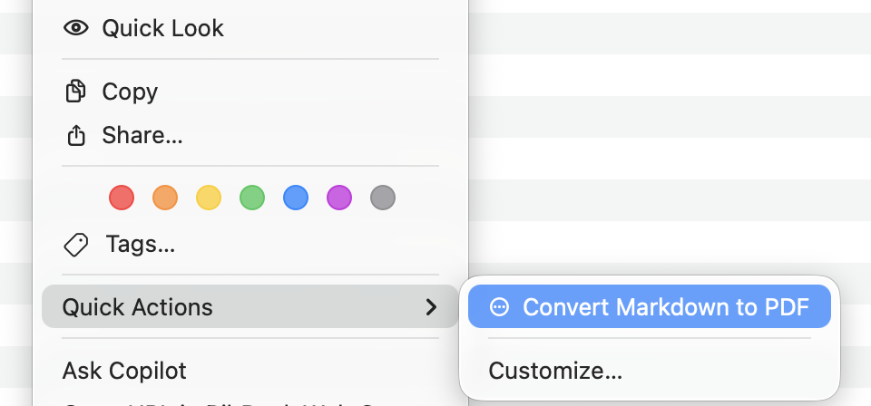

# md2pdf

> Convert Markdown to PDF with high-resolution Mermaid diagrams (SVG embedded in PDF output).

[](LICENSE)

`@dkothule/md2pdf` is a Markdown to PDF CLI for macOS and Linux with first-class Mermaid support.
It keeps Mermaid diagrams sharp in PDF by rendering vector assets (SVG by default) and includes automatic fallback logic for Mermaid flowcharts/graphs when needed.

## Why md2pdf

- Markdown to PDF from the terminal.
- Mermaid to PDF with high-resolution vector rendering.
- SVG-first pipeline for crisp diagrams at any zoom level.
- Auto fallback to Mermaid PDF for diagrams that use `foreignObject` labels.
- Fit-to-content PDF fallback (`--pdfFit`) to avoid full-page diagram artifacts.
- Better edge-label readability in flowchart/graph diagrams.
- Configurable defaults (`~/.config/md2pdf/config.env`, project `.md2pdfrc`, or `--config`).
- Optional Finder Quick Action integration on macOS.

## Install

### 1) Install system dependencies

From repo checkout, install required tools:

```bash
./install-system-deps.sh
```

### 2) Install md2pdf CLI

```bash
npm i -g @dkothule/md2pdf
python3 -m pip install pandocfilters
```

## System requirements

- `pandoc`
- LaTeX PDF engine (`xelatex` default)
- `librsvg` / `rsvg-convert`
- `python3`
- `node` + `npm`

## macOS Finder Quick Action (Optional)

Install Finder context menu action:

```bash
md2pdf-install-finder-action
```

Uninstall Finder context menu action:

```bash
md2pdf-uninstall-finder-action
```

If Finder menu does not refresh immediately:

```bash
killall Finder
```

After installation, right-click any `.md` file in Finder:

`Quick Actions` -> `Convert Markdown to PDF`



## Quick start

Convert Markdown to PDF (output goes beside input by default):

```bash
md2pdf ./notes.md
```

Custom output path:

```bash
md2pdf ./notes.md -o ./build/notes.pdf
```

Keep generated Mermaid assets for debugging:

```bash
md2pdf ./notes.md --keep-mermaid-assets
```

## Mermaid support details

md2pdf uses:

- `MERMAID_LATEX_FORMAT=svg` by default for vector quality in PDF.
- `MERMAID_AUTO_PDF_FALLBACK=true` by default to preserve flowchart/graph node labels when SVG uses `foreignObject`.
- `MERMAID_PDF_FIT=true` by default so Mermaid PDF fallback assets use tight bounds and do not force one-diagram-per-page.

## Configuration

Config precedence (later overrides earlier):

1. `$HOME/.config/md2pdf/config.env`
2. `<input-markdown-directory>/.md2pdfrc`
3. `--config /path/to/config.env`
4. Environment variables

Create starter config:

```bash
md2pdf --init
```

Create starter config at custom path:

```bash
md2pdf --init ./md2pdf.config.env --force
```

Example config:

```bash
PDF_ENGINE=xelatex
LR_MARGIN=0.7in
TB_MARGIN=0.5in
MERMAID_LATEX_FORMAT=svg
MERMAID_PDF_FIT=true
MERMAID_AUTO_PDF_FALLBACK=true
CLEANUP_MERMAID_ASSETS=true
MERMAID_ASSET_PREFIX=md2pdf-mermaid
```

## CLI reference

```bash
md2pdf --help
md2pdf --version
md2pdf --init
```

Common options:

- `-o, --output <file>`: output PDF path
- `--config <file>`: load additional config file
- `--keep-mermaid-assets`: keep generated Mermaid temp files
- `--cleanup-mermaid-assets`: remove generated Mermaid temp files (default)

## Test samples

- Smoke test: `tests/architecture-smoke-test.md`
- Mermaid sample pack: `tests/samples/mermaid-all-diagram-types.md`

Run:

```bash
md2pdf ./tests/architecture-smoke-test.md
md2pdf ./tests/samples/mermaid-all-diagram-types.md --keep-mermaid-assets
```

## Troubleshooting

- `mmdc not found`: install dependencies and verify `MERMAID_BIN`.
- Flowchart/graph labels missing in PDF: keep `MERMAID_AUTO_PDF_FALLBACK=true`.
- Diagram taking a full page: keep `MERMAID_PDF_FIT=true`.
- PDF engine missing: install `xelatex` or set `PDF_ENGINE`.

## Keywords

markdown to pdf, md to pdf, mermaid to pdf, mermaid svg, pandoc markdown pdf, markdown pdf cli, macOS markdown pdf, Linux markdown pdf

## License

MIT License, Copyright (c) 2026 Deepak Kothule
