# Mermaid All-Diagram Sample Pack

This file is a playground document with a broad set of Mermaid diagram types you can render with `md2pdf`.

## Emoji + Text Rendering Showcase

- ✅ Default path test: `xelatex` + SVG Mermaid + `twemojis/newunicodechar` mapping.
- 📈 Unicode symbols in text: `≥`, `≤`, `↗` should render without warnings.
- 😀 Emoji-in-text sample: if you can see this smiley in the PDF, emoji mapping is active.
- 🚀 Chromium mode option: `--renderer chromium` uses browser-native emoji shaping.

This page intentionally mixes emoji, symbols, and Mermaid diagrams so one sample file validates both text rendering and diagram quality.

## 1. Flowchart

```mermaid
flowchart LR
  A["📝 Markdown file"] -->|"⚙️ parse"| B["🧠 md2pdf CLI"]
  B --> C["🧩 Mermaid filter"]
  C --> D["📄 Final PDF"]
```

## 2. Sequence Diagram

```mermaid
sequenceDiagram
  participant U as 👩 User
  participant CLI as 🧠 md2pdf
  participant P as 📚 Pandoc
  participant M as 📡 Mermaid CLI

  U->>CLI: Convert README.md
  CLI->>P: Build document
  P->>M: Render Mermaid blocks
  M-->>P: SVG/PDF assets
  P-->>CLI: PDF bytes
  CLI-->>U: output.pdf ✅
```

## 3. Class Diagram

## 4. State Diagram

```mermaid
stateDiagram-v2
  [*] --> Idle
  Idle --> Parsing : "📥 input.md"
  Parsing --> Rendering : "🎨 Mermaid blocks found"
  Rendering --> Success : "✅ output.pdf"
  Rendering --> Failed : "❌ diagram error"
  Failed --> Idle : retry
  Success --> [*]
```

## 5. Entity Relationship Diagram

## 6. User Journey

```mermaid
journey
  title 🚀 User journey for md2pdf
  section Setup
    Install dependencies: 4: User
    Run md2pdf --init: 5: User
  section Convert
    Write markdown with Mermaid: 5: User
    Run md2pdf file.md: 5: User, md2pdf
    Review generated PDF: 4: User
```

## 7. Gantt Chart

```mermaid
gantt
  title 🗓️ md2pdf release checklist
  dateFormat YYYY-MM-DD
  section Build
  Rename package to scoped npm name :a1, 2026-02-01, 2d
  Add Mermaid fallback logic :a2, after a1, 3d
  section QA
  Verify PDF output on macOS :a3, after a2, 2d
  Verify PDF output on Linux :a4, after a2, 2d
```

## 8. Pie Chart

```mermaid
pie showData
  title 📊 Diagram usage split
  "Flowchart" : 35
  "Sequence" : 20
  "Class" : 10
  "State" : 10
  "Other types" : 25
```

## 9. Git Graph

```mermaid
gitGraph
  commit id: "🚀 init"
  commit id: "📦 scoped package"
  branch feature-mermaid
  checkout feature-mermaid
  commit id: "🧩 fallback"
  commit id: "🖼️ label fixes"
  checkout main
  merge feature-mermaid id: "🔀 merge"
  commit id: "✅ release"
```

## 10. Mindmap

```mermaid
mindmap
  root((🧠 md2pdf))
    CLI
      "⚙️ --init"
      "🧾 --config"
    Mermaid Rendering
      "🖼️ SVG default"
      "📄 PDF fallback"
      "📐 pdfFit"
    Output
      "📘 PDF"
      "🗂️ optional temp assets"
```

## 11. Timeline

```mermaid
timeline
  title 📅 md2pdf milestones
  2026-02-01 : Rename project to md2pdf
  2026-02-12 : Add global and local config loading
  2026-02-21 : Fix flowchart labels and page-fit fallback
```

## 12. Quadrant Chart

```mermaid
quadrantChart
  title ⚖️ Feature prioritization
  x-axis Low effort --> High effort
  y-axis Low impact --> High impact
  quadrant-1 Fast wins
  quadrant-2 Big bets
  quadrant-3 Low priority
  quadrant-4 Fill-ins
  "🛠️ --init config UX": [0.25, 0.72]
  "🖼️ foreignObject fallback": [0.42, 0.90]
  "📦 Finder quick action": [0.60, 0.58]
  "📚 docs polish": [0.18, 0.45]
```

## 13. Requirement Diagram

## 14. C4 Context Diagram

## 15. XY Chart (beta)

```mermaid
xychart-beta
  title "📈 Average render time by diagram type"
  x-axis ["Flowchart", "Sequence", "ER", "Gantt", "Pie"]
  y-axis "Milliseconds" 0 --> 120
  bar [30, 45, 24, 55, 20]
```

## 16. Sankey (beta)

